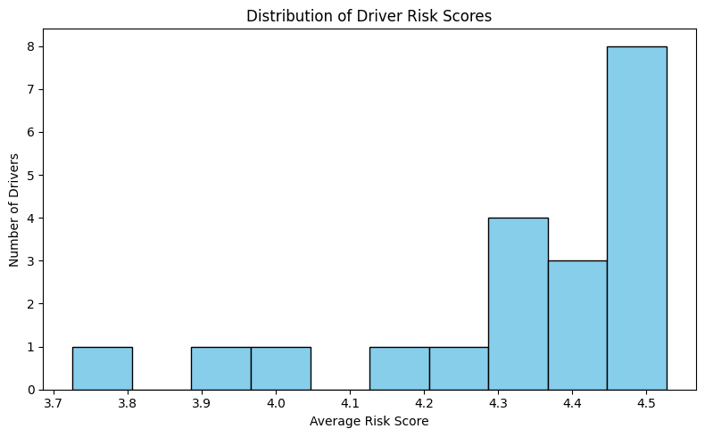
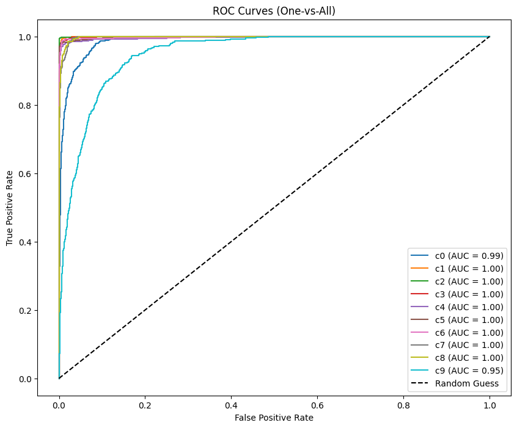

# Distracted Driver Detection using Deep Learning


An end-to-end computer vision project to classify distracted driving behaviors using transfer learning with EfficientNetB3. This repository contains a comprehensive Jupyter Notebook that covers the entire machine learning pipeline—from data preprocessing and augmentation to model training and evaluation—achieving approximately 89% validation accuracy.

---

## Table of Contents

- [Overview](#overview)
- [Project Architecture](#project-architecture)
- [Model Architecture & Methodology](#model-architecture--methodology)
  - [Transfer Learning Backbone](#transfer-learning-backbone)
  - [Custom Classification Head](#custom-classification-head)
  - [Staged Training Strategy](#staged-training-strategy)
- [Data Handling & Preprocessing](#data-handling--preprocessing)
  - [Driver-Based Splitting](#driver-based-splitting)
  - [Data Augmentation](#data-augmentation)
- [Driver Risk Scoring Framework](#driver-risk-scoring-framework)
- [Dataset Details](#dataset-details)
- [Results](#results)
- [Technologies Used](#technologies-used)
- [How to Run](#how-to-run)
- [Repository Structure](#repository-structure)

---

## Overview

This project tackles the critical safety issue of distracted driving by leveraging deep learning. Using the State Farm Distracted Driver Dataset, a sophisticated pipeline was developed to accurately identify 10 distinct classes of driver behavior, ranging from texting to safe driving. 

Beyond simple multi-class image classification, this project integrates a custom driver-level risk scoring framework to translate abstract model predictions into practical, actionable safety insights for individual drivers.

---

## Project Architecture

The entire project is structured as a monolithic Jupyter Notebook (`Distracted_driver_detection_nb.ipynb`). 

The architecture of the pipeline operates linearly:
1. **Data Ingestion**: Loads the image metadata and associates labels with the respective raw image paths.
2. **Preprocessing & Generator Configuration**: Sets up Keras `ImageDataGenerator` instances for real-time data feeding and augmentation.
3. **Model Construction**: Initializes the pre-trained EfficientNetB3 base and appends the custom classification top.
4. **Training Loop**: Executes the two-stage training process.
5. **Evaluation**: Predicts against the validation set and generates comprehensive metrics (Confusion Matrix, Classification Report, Per-Class Accuracy, ROC Curves, and AUC scores).
6. **Risk Analysis**: Calculates and visualizes individual driver safety scores based on predicted behavior frequencies.

---

## Model Architecture & Methodology

The core of the project is a deep Convolutional Neural Network (CNN) built upon the **EfficientNetB3** architecture.

### Transfer Learning Backbone

The model utilizes EfficientNetB3 initialized with weights pre-trained on the ImageNet dataset. EfficientNet was chosen for its optimal balance of high accuracy and computational efficiency through its compound scaling method. By leveraging pre-trained weights, the model comes with a robust inherent understanding of low-level visual features (edges, shapes, textures), drastically reducing the training time required for this specific task.

### Custom Classification Head

The original classification layers of EfficientNetB3 were discarded and replaced with a custom head designed for this 10-class problem:
1. **Global Average Pooling 2D**: Flattens the spatial dimensions of the final convolutional feature maps into a 1D vector, minimizing parameters and mitigating overfitting.
2. **Dropout (0.4)**: A regularization layer that randomly ignores 40% of the neurons during training, forcing the network to learn more robust features.
3. **Dense Output Layer**: A fully connected layer with 10 units utilizing a softmax activation function to output a probability distribution across the 10 distracted driving classes.

### Staged Training Strategy

To effectively fine-tune the model without destroying the valuable pre-trained weights, a staged training methodology was implemented:
- **Stage 1 (Feature Extraction)**: The entire EfficientNetB3 backbone is frozen. Only the newly initialized custom classification head is trained (using Adam optimizer with a learning rate of 1e-3). This allows the head to securely map extracted features to the new classes.
- **Stage 2 (Fine-Tuning)**: The backbone layers are unfrozen. The entire architecture is then trained jointly at a significantly reduced learning rate (1e-5). This step carefully tunes the high-level feature extractors within EfficientNet specifically to the distracted driving domain.

---

## Data Handling & Preprocessing

Robust data management is critical in computer vision, especially when dealing with human subjects where data leakage is a severe risk.

### Driver-Based Splitting

Instead of standard random splitting, the dataset is split at the **subject (driver) level**. An 80/20 train-validation split is applied to the unique lists of driver IDs. This ensures that the validation set contains entirely unseen drivers, proving the model's ability to generalize to new individuals rather than just memorizing the physical characteristics or clothing of the training subjects.

### Data Augmentation

To artificially expand the training dataset and prevent overfitting, the `ImageDataGenerator` applies real-time augmentations during Stage 1 and Stage 2 training:
- Rotation mapping (up to 15 degrees)
- Width and Height shifting (10%)
- Zoom ranges (10%)
- Horizontal flipping
- Preprocessing specific to EfficientNet constraints.

Images are standardized and resized to 300x300 pixels before being fed into the network in batches of 16.

---

## Driver Risk Scoring Framework

A unique aspect of this project is the translation of classification into actionable safety metrics. A custom severity mapping assigns a penalty weight to each distracted action. For example:
- Safe Driving: 0 points
- Drinking / Talking to passenger: 2 points
- Operating radio: 3 points
- Talking on phone: 4 points
- Texting: 5 points

By evaluating a continuous stream of predictions for a specific subject, the system calculates an average "Risk Score", allowing for a quantifiable assessment of individual driver safety performance over time.

---

## Dataset Details

The dataset originates from the public Kaggle competition: State Farm Distracted Driver Detection. It contains thousands of dashboard camera images categorized into 10 fundamental classes:

- c0: Safe driving
- c1: Texting - right
- c2: Talking on the phone - right
- c3: Texting - left
- c4: Talking on the phone - left
- c5: Operating the radio
- c6: Drinking
- c7: Reaching behind
- c8: Hair and makeup
- c9: Talking to passenger

### Class Distribution
Here is the distribution of the different distracted driving offenses across the training dataset:



---

## Results

Extensive evaluation on the strictly driver-separated validation set yielded the following results:

- **Validation Accuracy**: Approximately 89%
- **Robust Generalization**: Maintained strong precision and recall across all 10 classes.
- **Metrics Provided**: The notebook outputs detailed confusion matrices, classification reports, per-class accuracy bar charts, and One-vs-All ROC curves with calculated AUC values.

### Confusion Matrix
The confusion matrix below demonstrates the model's high precision in separating subtle actions, such as 'Texting - right' vs 'Talking on phone - right'.


### ROC Curves
The One-vs-All Receiver Operating Characteristic (ROC) curves illustrate the strong diagnostic ability of the EfficientNetB3 classifier across all 10 distracted driving classes, achieving high AUC scores.



---

## Technologies Used

- **Language**: Python 3
- **Core Framework**: TensorFlow / Keras (Deep Learning, Transfer Learning, Image Generators)
- **Data Manipulation**: Pandas, NumPy
- **Machine Learning Utilities**: Scikit-Learn
- **Image Processing**: OpenCV, PIL
- **Visualization**: Matplotlib, Seaborn
- **Environment**: Jupyter Notebook

---

## How to Run

1.  **Clone the repository:**
    ```bash
    git clone https://github.com/agam25rpro/Driver_Detection.git
    cd Driver_Detection
    ```

2.  **Install the required libraries:**
    ```bash
    pip install tensorflow pandas numpy scikit-learn opencv-python matplotlib seaborn tqdm pillow
    ```

3.  **Download the dataset:**
    - Download the data from the Kaggle State Farm Distracted Driver Detection competition.
    - Unzip and structure the folders such that the `imgs/train`, `imgs/test`, and `driver_imgs_list.csv` exist. Update the absolute paths in the notebook as necessary for your local file system.

4.  **Launch Jupyter Notebook:**
    ```bash
    jupyter notebook
    ```
    Open `Distracted_driver_detection_nb.ipynb` and execute the cells sequentially.

---

## Repository Structure

```
.
└── Distracted_driver_detection_nb.ipynb   # Comprehensive notebook containing all code logic
└── README.md                              # Project documentation
```
